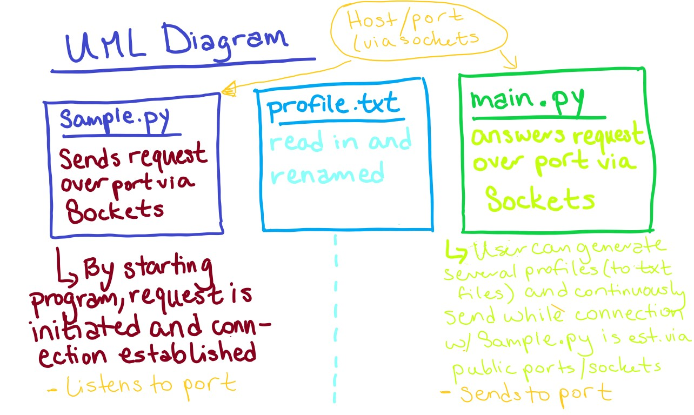

# UBERFIT README
A desktop application to find a running partner/coach. This application also serves as a 
Microservice for an associated Workout generator application.

## Table of Contents

- Requirements
- REQUEST Data Instructions
- RECEIVE Data Instructions
- UML Sequence diagram

Clear instructions for how to programmatically REQUEST data from the microservice you implemented. Include an example call.
Clear instructions for how to programmatically RECEIVE data from the microservice you implemented.
UML sequence diagram showing how requesting and receiving data works. Make it detailed enough that your partner (and your grader) will understand
## Requirements 
No Special Requirements

## REQUEST Data Instructions
On your local machine, run the sample.py program. Click 'Submit' in the window that populates.
In the terminal, you will be prompted to "Enter number of clients", type '1'.

{This feature allows you to request multiple profiles at once, but for the sample, just ask for 1}

At this point, on your local machine run 'main.py'. Click 'Login'. You will see a window with several
options. Click 'Send Profile to Request Workout', in the window that pops up, enter the name of the profile
file name (the default is profile.txt, which I have previously generated by filling out the registration form
within my app).

## RECEIVE Data Instructions
You will now see in the sample.py terminal "Received successfully! New filename is: " followed by the name of the
file. This should be in the same folder from which you have been running these programs. You can now use this JSON file 
as you'd like in your own program or modify the Sample.py program for your own needs.

## UML Sequence Diagram 
See the diagram below for further explanation of how these two programs communicate using Python Sockets. 

